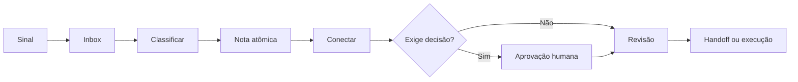

# Maestro — Segundo Cérebro

> Fonte única de verdade rastreável para conhecimento, decisões, riscos, evidências e handoffs do projeto.

## Estado atual

| Item | Estado |
| --- | --- |
| Projeto | Maestro — Plataforma de Orquestração Humano–IA |
| Fase | Descoberta e definição do MVP |
| Objetivo | Acompanhar e coordenar fluxos de uma operação de desenvolvimento humano–IA |
| Ambiente conhecido | Codex + VM Oracle + Obsidian |
| Políticas | Rascunho; aguardando responsáveis e aprovação |
| Lacunas principais | Papéis, dados, retenção, segurança existente e autonomia |

## Acesso rápido

- [[00 Inbox/INBOX|Inbox]]
- [[01 Projeto Maestro/00-MAPA-DO-PROJETO|Mapa do projeto]]
- [[01 Projeto Maestro/04 Hipóteses e perguntas/PERGUNTAS-ABERTAS|Perguntas abertas]]
- [[01 Projeto Maestro/15 Decisões/REGISTRO-DE-DECISOES|Registro de decisões]]
- [[01 Projeto Maestro/16 Riscos e bloqueios/REGISTRO-DE-RISCOS|Riscos e bloqueios]]
- [[20 Cybersecurity & Compliance/00-MAPA-DE-SEGURANCA|Cybersecurity e compliance]]
- [[21 Políticas e Práticas de Desenvolvimento/Políticas da Empresa/00-RESUMO-GERAL|Políticas da empresa]]
- [[23 Checklists e Gates/00-INDICE-DE-CHECKLISTS|Checklists e gates]]
- [[99 Sistema/00-COMANDOS|Comandos do cérebro]]
- [[99 Sistema/Prompts/PROMPT-OPERADOR|Prompt do operador]]

## Fluxo de conhecimento

## Rotina recomendada

- **Durante o trabalho:** capturar sinais e evidências.
- **Fim da sessão:** processar Inbox e gerar handoff.
- **Diariamente:** revisar bloqueios, riscos e aprovações.
- **Semanalmente:** revisar decisões, hipóteses e políticas.
- **Após incidentes ou mudanças críticas:** registrar evidências e atualizar controles.

